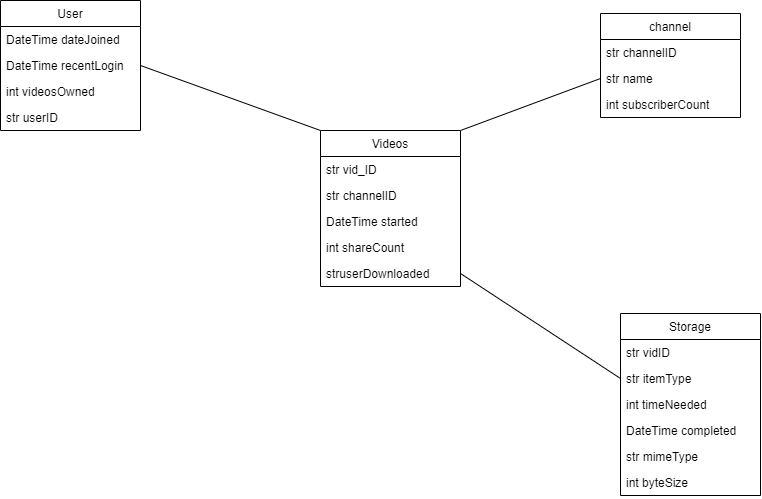

# ***Pull Den***

Cloud Computing Group Project - Video Archiving Application

## [Web Application Link](https://pull-den-web-app-prdbw7yvpq-uc.a.run.app/)

## [Web App Repository](https://github.com/aguerrero232/pull-den-web-app)

## **Collaborators**

* Ariel Guerrero
* Shejan Shuza
* Hunter Long
* Viswa Bhargavi

## ***Video***

## ***Description***

The service can allow a user to submit a YouTube video link to the service, and the service will create a
clone of the video (downloading from YouTube) on Cloud Storage (including video metadata like descriptions, subtitles, thumbnails, etc.), the user will then receive a “master link” that allows modification of the permissions to their sharable link to the video on the service (count of usable clicks, duration, login requirements, etc.). The service also supports interacting with the native YouTube API for searching and showing suggestions on videos.

## ***Goals***

1. Construct APIs for pulling various parts of a YouTube video, including the video itself,
descriptions, subtitles, thumbnails, etc. based on yt-dlp
2. Understand and produce a Pub/Sub workflow for accepting user YouTube links for concurrent downloading
3. Format a Cloud Storage Bucket to support avoiding duplicates and storing potentially large data.
4. Integrate the service workflow to support Google’s BigQuery to gather statistics and analytics of
the service itself.

### ***Utilized Tools and Services***

1. Cloud Functions (API environment)
2. Pub/Sub (function organization and concurrency)
3. Cloud Storage (data storage)
4. BigQuery (SQL-like storage)
5. Google Analytics 4 (GTAG powered user analytics tool, dumps to BigQuery)
6. Google OAuth 2.0 (used for assigning users)
6. yt-dlp (a fork of youtube-dl with better performance)
7. ffmpeg (used as part of youtube-dl, used for combining and converting media files, could be
used for creating separate versions of a video)
8. Angular (used as the frontend environment loaded to the user)
9. Python 3.9 (used as the basis of youtube-dl and used as the language of the APIs)

### ***Python packages (PyPi)***

1. [yt-dlp](https://pypi.org/project/yt-dlp/)
2. [google-cloud-storage](https://pypi.org/project/google-cloud-storage/)
3. [google-cloud-firestore](https://pypi.org/project/google-cloud-firestore/)
4. [google-cloud-bigquery](https://pypi.org/project/google-cloud-bigquery/)
5. [Pillow](https://pypi.org/project/Pillow/)

## ***Technical Documentation***

The frontend is deployed using Cloud Run initiating a Dockerfile to install the application dependencies, build the project, and get the server to start to serve the application. The web app is also utilizing CI/CD provided by GitHub to deliver the Angular based website to the user's system. The Angular based program executes YouTube API calls to fill a suggestions page, and handle logins with Google OAuth. If a user clicks a download button, this sends a HTTP trigger request to a Cloud Function that initiates checks for whether the video is downloaded, and whether the video is owned by the user already (this search mechanism is controlled by YouTube API to ensure no further pulls of unaccessible videos can occur), if it is not owned but downloaded, an ownership is assigned to the logged in user. If not downloaded, this Cloud Function publishes to a Pub/Sub topic that initiates several Cloud Functions that concurrently download the appropriate video's content and metadata. These functions use the yt-dlp library to start a download to their local RAM file systems, if successful, they upload to Cloud Storage buckets that store the files in a permanent manner and update FireStore and BigQuery databases. The frontend then utilizes these databases to effectively provide user specific functionalities.

Google Analytics Engine is also setup to the project to allow GTAGs to function within the frontend, this dumps to Google's Analytics environment which has a link to the BigQuery database that updates every day with new user information that is gathered in that previous day. This can be used with BigQuery's analysis tools to provide in-depth analytics of the users and systems used on the service (as well as the content dumped by the backend).

## ***How BigQuery is used***

BigQuery is used to support analytics of the service during its execution. BigQuery is a OLAP based SQL-like database that is primarily used for providing in-depth analysis of real-time situations. OLAP databases utilize a star-schema structures for tables that are organized in datasets, in which none of the tables have explicit connections like foreign keys, only relationships by storing specific informations that can be related to each other.The data stored in BigQuery is not used in the frontend as the information could contain confidential informations (GTAG).

Google provides a PyPi package for implementing BigQuery into Python programs which is used in our Cloud Functions to effectively update the database during the backend's functionality. The backend functions utilize DML query calls to the BigQuery dataset that update the dataset's tables with new information. Each backend functions adds information specific to it's own functionality to the BigQuery database, such as the storage consumed by a file in the database or when content is added, or how many shares a specific video has.

This can be examined by the developers through the BigQuery interface to analyze the environment without directly having to bother the FireStore environment which is accessible to the public, and abstracts away the viability of the end user having access to more confidential information.

## ***Architecture Diagram***

## ***Work Discord***

[Discord](https://discord.gg/6AmEpgpPtu)

## ***Trello Board***

[Trello](https://trello.com/b/IAi19oex/cloudcomputingpullden)

## ***Test API***

The test API can be found [here](https://us-central1-cs4843-youtube-dl.cloudfunctions.net/test-youtube-video-download?link=), change the argument value of "link".
